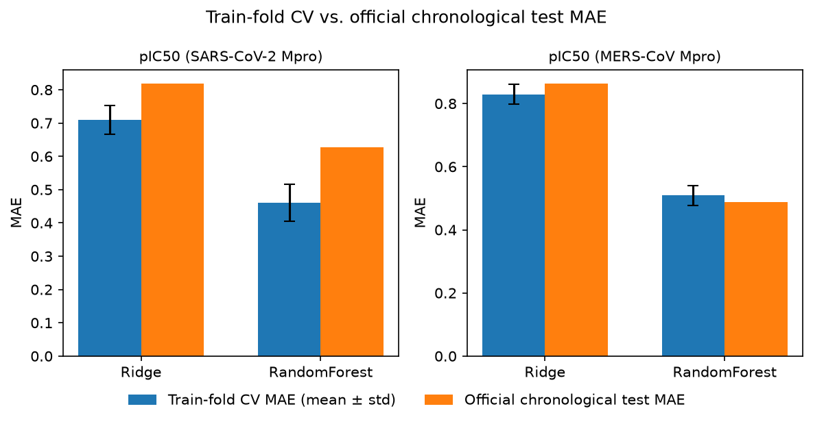
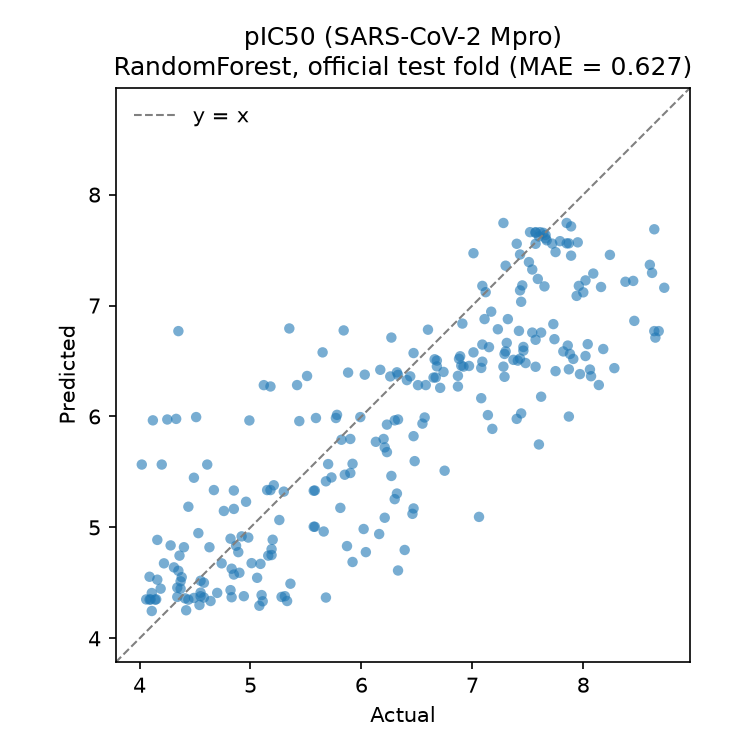
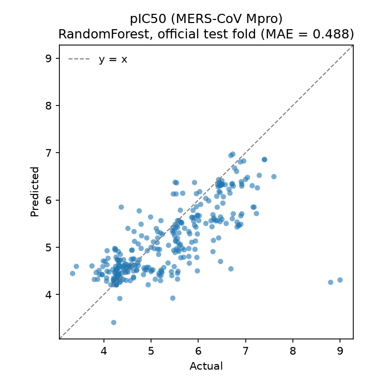
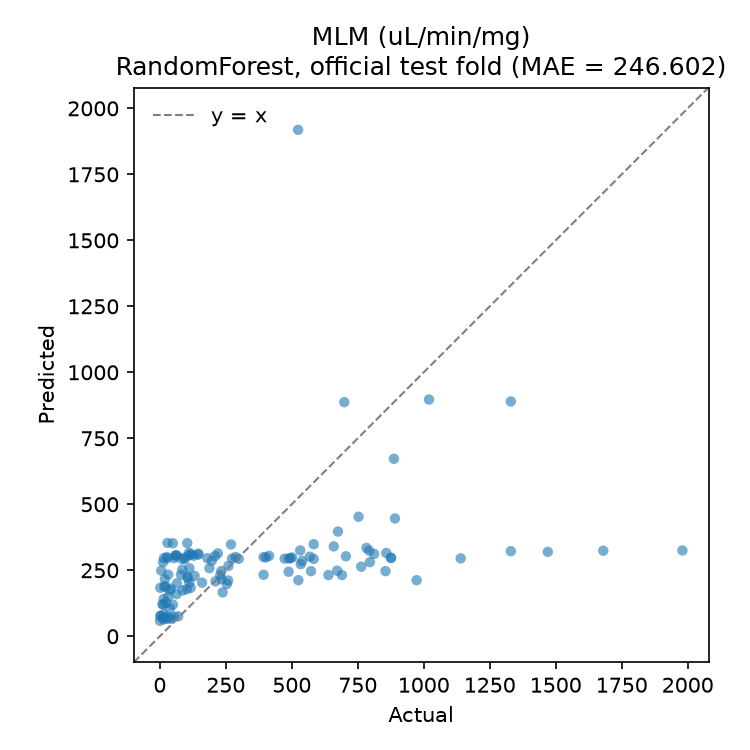
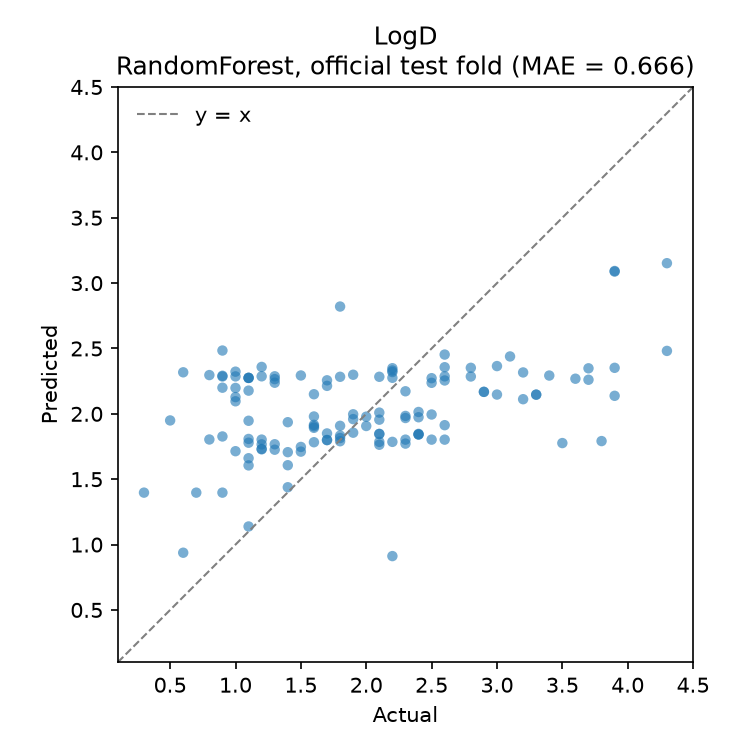
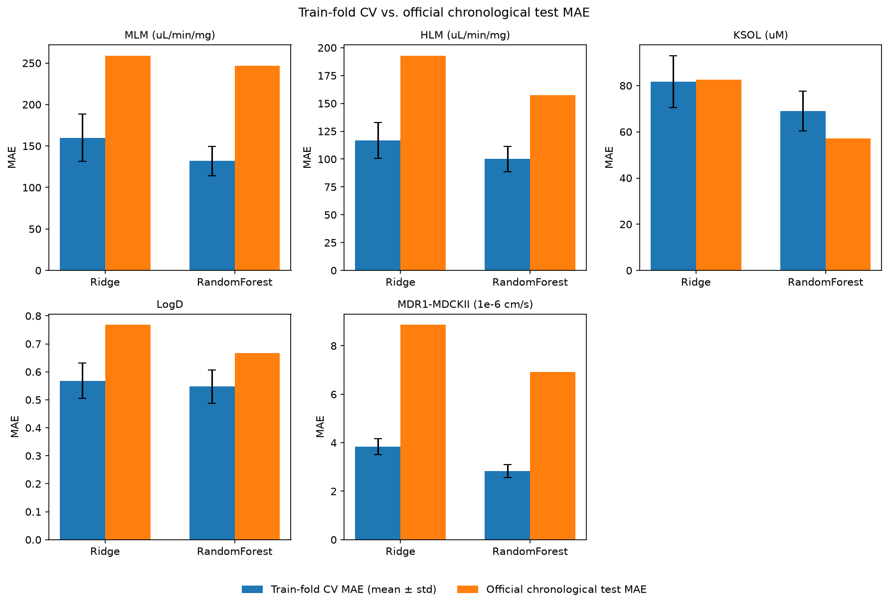

# Polaris ASAP Antiviral — Retrospective Benchmark

## Scientific goal

A rigorous, reproducible evaluation of ML models on two [ASAP Discovery x Polaris x
OpenADMET "Antiviral" 2025 challenges](https://polarishub.io/organization/asap-discovery):

1. **Potency** — predicting pIC50 against **SARS-CoV-2 Mpro** and **MERS-CoV Mpro**.
2. **ADMET** — predicting five pharmacokinetic endpoints (metabolic stability,
   solubility, lipophilicity, permeability).

Both challenges have concluded and been unblinded, so this project runs them
**retrospectively**: the goal is not to compete on a leaderboard, but to demonstrate a
methodologically sound evaluation pipeline for a real prospective drug-discovery
benchmark — the kind of rigor (correct split, no leakage, matching the official metric
where that's actually possible, and being explicit where it isn't) that's easy to get
subtly wrong and that matters more than squeezing out extra accuracy from a fancier
model.

## Data and evaluation approach

- **Datasets**:
  [`asap-discovery/antiviral-potency-2025-unblinded`](https://polarishub.io/datasets/asap-discovery/antiviral-potency-2025-unblinded)
  (1,328 molecules) and
  [`asap-discovery/antiviral-admet-2025-unblinded`](https://polarishub.io/datasets/asap-discovery/antiviral-admet-2025-unblinded)
  (560 molecules), both on Polaris Hub (CC0-1.0). These are the post-challenge releases
  with test-set labels revealed — the original `competition` artifacts on Polaris Hub
  hide test labels by design, so they can't be used for a self-contained retrospective
  evaluation.
- **Split — official, chronological, not random**: each dataset's `Set` column
  (`Train`/`Test`) reproduces the exact temporal split ASAP Discovery used to score the
  original blind challenges (Potency: 1,031/297; ADMET: 434/126 — both match the sizes
  published on their respective competition pages exactly). A random split would leak
  information from the future into training and overstate performance relative to the
  real prospective setting these challenges are meant to simulate; we never use one for
  headline results.
- **Metric — Potency**: mean absolute error (MAE), computed exactly the way
  `polaris-lib` computes it internally — `sklearn.metrics.mean_absolute_error`, per
  target, on rows where that target's label isn't missing (the dataset is sparse: not
  every molecule was assayed against both targets), with **no cross-target aggregation**
  (confirmed from `polaris/evaluate/_metric.py`, which explicitly raises
  `NotImplementedError` for multitask aggregation). See [`src/evaluate.py`](src/evaluate.py).
- **Metric — ADMET (deliberately simplified, see below)**: the official ADMET
  competition scores `MLM`/`HLM`/`KSOL`/`MDR1-MDCKII` using *"MAE on the log-transformed
  endpoint, after clipping to the strictly positive detection limit"* (`LogD` gets plain
  MAE directly, since it's already log-scale). Polaris/ASAP have **not published the
  exact clip thresholds**, and third-party competition reproductions report the
  organizers changed the transform (`log` vs. `log1p`) mid-competition — so there is no
  primary source to verify this against, and that transform lives in ASAP's own
  challenge-specific scoring, not in `polaris-lib` itself (confirmed: the library's
  generic `evaluate()` only does plain masked MAE, no built-in transform). Rather than
  guess unpublished thresholds, **every ADMET endpoint here is scored with the same
  plain masked MAE used for potency** — see [`src/data.py`](src/data.py) for the full
  reasoning. The results below show exactly why the official metric applies a
  transform: raw-scale MAE for `MLM`/`HLM` is dominated by a handful of outlier
  molecules and is not very informative on its own.
- **No leakage**: featurization (Morgan fingerprints) is a deterministic structural hash
  with nothing fit on data, so it's leakage-free by construction. Where a step *does*
  fit on data (the `StandardScaler` inside the Ridge baseline), it is fit on the
  training fold only and merely applied to the test fold. See
  [`src/train_baseline.py`](src/train_baseline.py).
- **Baseline models**: Morgan fingerprints (RDKit, radius=2, 2048 bits) + Ridge
  regression and RandomForest — deliberately simple, CPU-only, no deep learning.
- **Cross-validation (diagnostic, not headline)**: 5-fold CV on the train fold only,
  reported as an internal stability check (mean ± std MAE across folds). This is a
  random split *within* the training data — it never touches the test fold, so it
  cannot leak into or replace the headline chronological-test number; it exists purely
  to show how much a model's error varies depending on which training rows it sees. Any
  per-fold data-dependent step (Ridge's `StandardScaler`) is fit on that fold's training
  partition only, same as the full pipeline. See
  [`src/cross_validate.py`](src/cross_validate.py).
- **Determinism**: all seeds fixed (`RANDOM_SEED = 0` in
  [`src/train_baseline.py`](src/train_baseline.py)); RandomForest is run with
  `n_jobs=1` because parallel tree aggregation can otherwise change floating-point
  summation order across runs, breaking bit-for-bit reproducibility even with a fixed
  `random_state`. Verified: repeated runs of both pipelines produce byte-identical
  `results/*.json`.

Both tasks share the same pipeline ([`src/pipeline.py`](src/pipeline.py)) — they only
differ in dataset, target columns, and (for ADMET) the metric caveat above.

## Results — Potency

| Target | n train | n test | Ridge 5-fold train-CV MAE | Ridge **official test MAE** | RF 5-fold train-CV MAE | RF **official test MAE** |
|---|---|---|---|---|---|---|
| pIC50 (SARS-CoV-2 Mpro) | 842 | 263 | 0.710 ± 0.043 | **0.819** | 0.461 ± 0.056 | **0.627** |
| pIC50 (MERS-CoV Mpro) | 901 | 297 | 0.829 ± 0.031 | **0.864** | 0.509 ± 0.032 | **0.488** |

The bold columns are the headline numbers (official chronological test fold).

(Regenerate with `uv run python scripts/run_baseline.py`; full numbers, including
per-fold CV values, in [`results/potency_metrics.json`](results/potency_metrics.json).
Plots are written to [`results/plots/`](results/plots/) from the predictions actually
scored above — they are never a separately-recomputed figure, so they can't drift from
the numbers in the table.)

### Write-up

**The chronological split exposes a real generalization gap — a random split would have
hidden it.** For SARS-CoV-2 Mpro, RandomForest's train-fold CV MAE (0.461) is ~36% lower
than its official chronological-test MAE (0.627); for Ridge, 0.710 vs. 0.819. Both models
look meaningfully better than they actually are on genuinely prospective data if you only
look at (random-split) cross-validation. For MERS-CoV Mpro the gap nearly disappears
(RandomForest: 0.509 CV vs. 0.488 test) — the harder, more realistic evaluation is
target-dependent, not a fixed penalty.



**RandomForest compresses predictions at the high-potency extreme — the practically
important region.** In the SARS-CoV-2 parity plot, points above the true pIC50 ≈ 7 are
systematically under-predicted (blue points falling below the y = x line at the top
right): the model regresses toward the bulk of the training distribution and can't
extrapolate to the most potent compounds. That's a real limitation for prospective drug
discovery, since the whole point of the exercise is finding compounds *better* than
what's already been made — an aggregate MAE alone hides this.



**MERS-CoV Mpro predictions are comparatively well calibrated across the range**, tracking
the y = x line more closely with fewer high-end outliers, other than two low-predicted
points near pIC50 ≈ 9 (the single most potent compounds in the test set — an
extrapolation failure in the same direction as above, just for a smaller fraction of the
data given the label distribution here).



## Results — ADMET

| Endpoint | n train | n test | Ridge test MAE | RF test MAE |
|---|---|---|---|---|
| MLM (µL/min/mg) | 303 | 122 | 259.1 | 246.6 |
| HLM (µL/min/mg) | 301 | 106 | 193.0 | 157.4 |
| KSOL (µM) | 365 | 112 | 82.7 | 57.1 |
| LogD | 352 | 126 | 0.768 | 0.666 |
| MDR1-MDCKII (1e-6 cm/s) | 425 | 126 | 8.87 | 6.93 |

(Regenerate with `uv run python scripts/run_admet_baseline.py`; full numbers, including
CV, in [`results/admet_metrics.json`](results/admet_metrics.json).)

### Write-up

**The MLM/HLM numbers above look enormous, and that's the point.** These are exactly the
endpoints the official competition applies a log-transform to before scoring — and
without it, raw-scale MAE is dominated by a handful of outlier molecules. The
SARS-CoV-2-flavored parity plot for MLM makes this obvious: one compound with actual
clearance ≈ 500 µL/min/mg gets predicted at ≈ 1,900, and several compounds with actual
values above 1,000 are all predicted in a tight band around 250–350 — a handful of large
errors swamp an MAE computed on the raw scale. This isn't a bug in the baseline; it's a
direct demonstration of *why* ASAP's official metric applies a transform in the first
place, and why reporting a metric without understanding what it does to outliers is a
methodology mistake, not just a modeling one.



**LogD is the one endpoint where our metric is exactly the official one** (both are plain
MAE, since LogD is already log-scale) — and here the baseline looks like a normal,
reasonably-behaved regression problem (MAE ≈ 0.67–0.77), not the wild numbers above.
That contrast is itself evidence the MLM/HLM/KSOL/MDR1-MDCKII numbers are a metric-choice
artifact rather than proof those endpoints are uniquely unlearnable.



**RandomForest beats Ridge on every ADMET endpoint**, unlike potency where the margin
varied by target — plausibly because several endpoints here are noisier/more
outlier-prone, where RandomForest's robustness to outliers in the *training* data (it
splits on order statistics, not squared error) helps more than Ridge's global linear fit.



## Setup

```bash
uv sync
```

Requires network access to Polaris Hub (no account/login needed — both datasets are
public/CC0). If your network does TLS interception (e.g. a campus/corporate proxy),
you may need `uv sync --system-certs`.

## Usage

```bash
uv run python scripts/run_baseline.py        # Potency
uv run python scripts/run_admet_baseline.py  # ADMET
```

## Tests

```bash
uv run pytest
```

15 tests, no network access, runs in a few seconds. These verify the claims made above
rather than just asserting them in docstrings/comments:

- **Leakage**: `test_train_baseline.py` independently reimplements "scaler fit on train
  only" and asserts `fit_predict_ridge` matches it exactly, and separately asserts
  predictions for a fixed set of test rows are unchanged when *other* test rows are
  added/changed (a leaky train+test-fit scaler would shift every prediction). Verified
  these actually catch a regression: temporarily reverting the scaler to fit on
  train+test combined fails both tests with real numeric mismatches, then confirmed
  clean again after reverting.
- **Determinism**: bitwise-identical predictions across repeated calls with the same
  seed (regression test for the `n_jobs=1` fix - see the CV/determinism note above).
- **Split correctness**: `test_data.py` asserts `official_chronological_split` produces
  a disjoint, complete partition driven only by the `Set` column value of each row, not
  row order or position.
- **CV fold isolation**: `test_cross_validate.py` asserts each fold's train/validation
  partition is disjoint and covers all rows, and that results are reproducible given a
  fixed seed.

## Project structure

```
src/
  data.py               # load datasets from Polaris Hub, build official chronological split
  features.py           # Morgan fingerprint featurization (RDKit)
  evaluate.py            # MAE harness matching polaris' own metric logic
  train_baseline.py      # leakage-free Ridge / RandomForest baselines
  cross_validate.py      # 5-fold CV on the train fold (diagnostic only)
  plots.py                # parity plots + CV-vs-test grid, from already-computed predictions
  pipeline.py             # shared end-to-end pipeline used by both tasks
scripts/
  run_baseline.py        # Potency task entry point
  run_admet_baseline.py  # ADMET task entry point
tests/
  test_evaluate.py        # masked_mae vs. sklearn, NaN handling
  test_data.py             # official_chronological_split correctness
  test_train_baseline.py   # leakage + determinism checks
  test_cross_validate.py   # CV fold isolation + determinism
results/
  potency_metrics.json
  admet_metrics.json
  plots/
```

## Scope

This is an initial baseline for both tasks. Deliberately out of scope for now: graph
neural networks or other deep models, hyperparameter tuning, and reproducing ASAP's
unpublished ADMET metric transform — see the project's hard rules and the metric note
above for why (CPU-only laptop reproducibility, start simple before adding complexity,
don't guess at unverifiable specifics).
